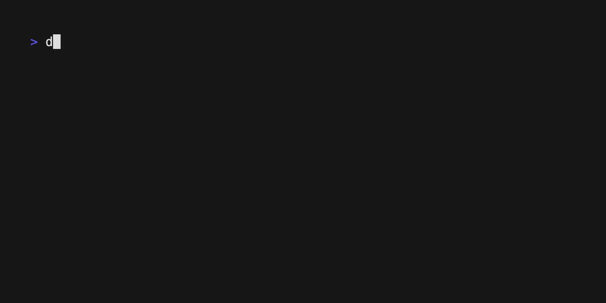

# Hooke
> ut tensio, sic vis

A simple, efficient spring animation library for smooth, natural motion.



## Usage

Hooke is framework-agnostic and works well in 2D and 3D contexts. Simply call
`Spring.make` with your settings to initialize and `Spring.update` on each
frame to animate.

```ocaml
open Hooke

(* A thing we want to animate. *)
let sprite_x = Spring.zero_snapshot in

(* A spring to animate it with *)
let spring = Spring.make ~delta_time:0.016 ~angular_freq:6. ~damping_ratio:0.5 in

(* Where we want to animate it. *)
let target_pos = 50.0 in

(* Animate! *)
while true do
  let new_sprite_x = Spring.update spring sprite_x in
  (* throttle frames *)
  animate ()
done

...
```

## Creating Springs

`Spring.make` takes three values:

* `delta_time`: the time step to operate on. Game engines typically provide
  a way to determine the time delta, however if that's not available you can
  simply set the framerate with `1_000 /. fps`. Make
  sure the framerate you set here matches your actual framerate.
* `angular_freq`: this translates roughly to the speed. Higher values are
  faster.
* `damping_ratio`: the springiness of the animation, generally between `0`
  and `1`, though it can go higher. Lower values are springier. For details,
  see below.

## Damping Ratios

The damping ratio affects the motion in one of three different ways depending
on how it's set.

### Under-Damping

A spring is under-damped when its damping ratio is less than `1`. An
under-damped spring reaches equilibrium the fastest, but overshoots and will
continue to oscillate as its amplitude decays over time.

### Critical Damping

A spring is critically-damped the damping ratio is exactly `1`. A critically
damped spring will reach equilibrium as fast as possible without oscillating.

### Over-Damping

A spring is over-damped the damping ratio is greater than `1`. An over-damped
spring will never oscillate, but reaches equilibrium at a slower rate than
a critically damped spring.

## Acknowledgements

This library is a fairly straightforward port of [Charm][charm]'s
[Harmonica][harmonica], which is a port of [Ryan Juckett][juckett]’s excellent
damped simple harmonic oscillator originally written in C++ in 2008 and
published in 2012. [Ryan’s writeup][writeup] on the subject is fantastic.

[charm]: https://charm.sh/
[harmonica]: https://github.com/charmbracelet/harmonica/
[juckett]: https://www.ryanjuckett.com/
[writeup]: https://www.ryanjuckett.com/damped-springs/
